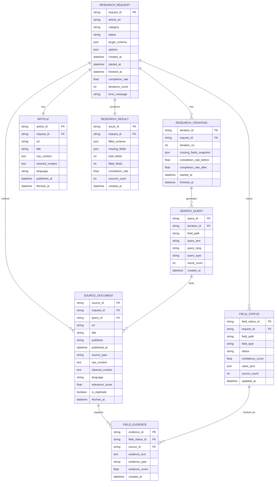

# 📄 PRD: API 기반 자기완결형 심층조사 에이전트

## 1. 제품 개요

### 1.1 제품명

**Iterative Research Agent API (IRA API)**

### 1.2 한 줄 정의

원문 기사 URL과 카테고리를 입력받아, 관련 자료를 반복적으로 검색·수집·분석하여 목표 JSON 스키마를 최대한 완전하게 채운 뒤, 그 결과를 API 응답으로 반환하는 백엔드 리서치 서비스.

### 1.3 제품 형태

* 프론트엔드 없음
* 외부 서비스와 **HTTP API**로만 통신
* 요청을 받아 비동기/동기 방식으로 처리 후 JSON 반환
* 핵심 역할은 **리서치 오케스트레이션 + 구조화 결과 생성**

---

## 2. 문제 정의

기존 수작업 방식은 다음 문제가 있다.

* 기사 1개만으로는 심층조사 항목을 모두 채우기 어렵다.
* 사람이 직접 관련 기사와 보조 자료를 반복 검색해야 한다.
* 어떤 항목이 비었는지 체계적으로 관리하기 어렵다.
* 조사 결과의 형식이 일관되지 않는다.
* 출처 추적이 불안정하다.

이 API의 목표는 이런 문제를 해결해, 입력만 주면 **표준화된 조사 JSON**을 안정적으로 반환하는 것이다.

---

## 3. 목표

### 3.1 비즈니스 목표

* 리서치 자동화
* 구조화된 데이터 생산
* 블로그/리포트/콘텐츠 생성의 입력 데이터 자동 확보
* 출처 기반 신뢰성 확보

### 3.2 제품 목표

* URL + 카테고리만으로 조사 수행
* 누락 필드 자동 탐지
* 부족한 필드에 대해 재검색 반복
* 결과를 일관된 JSON 형태로 반환
* API 소비자가 바로 후속 처리 가능하도록 설계

---

## 4. 사용자 및 사용 시나리오

### 4.1 주요 사용자

* 콘텐츠 생성 백엔드
* 블로그 자동화 시스템
* 내부 리서치 자동화 파이프라인
* 트렌드 모니터링 시스템

### 4.2 대표 시나리오

1. 외부 시스템이 기사 URL과 카테고리를 API로 전달
2. 시스템이 기사 내용을 파싱
3. 유사 기사와 보강 자료를 자동 수집
4. 목표 스키마를 기준으로 1차 구조화
5. 비어있는 필드를 탐지
6. 검색어를 생성하여 추가 검색
7. 반복 보강
8. 완성된 JSON을 반환

---

## 5. 범위 정의

## 5.1 포함 범위

* 기사 URL 입력 처리
* 카테고리별 스키마 선택
* 원문 기사 파싱
* 유사 기사 검색
* 기사/웹페이지 텍스트 추출
* 스키마 기반 구조화
* 누락 필드 탐지
* 재검색어 생성
* 반복 보강
* 결과 JSON 반환
* 요청/응답 이력 저장
* 출처 및 반복 로그 저장

## 5.2 제외 범위

* 프론트 UI
* 수동 편집 인터페이스
* 사용자 로그인 화면
* 대시보드
* 리포트 렌더링 화면

---

## 6. 입력 / 출력 정의

## 6.1 API 입력

### 필수 파라미터

* `article_url`: 원문 기사 URL
* `category`: 조사 카테고리
* `target_schema`: 선택 또는 직접 전달 가능

### 기본 요청 예시

```json
{
  "article_url": "https://example.com/article/123",
  "category": "해외 동향"
}
```

### 확장 요청 예시

```json
{
  "article_url": "https://example.com/article/123",
  "category": "해외 동향",
  "target_schema": {
    "category": "해외 동향",
    "topic": "",
    "researched_at": "",
    "sources_master": [],
    "trend_name": { "value": "", "sources": [], "notes": "" },
    "definition": { "value": "", "sources": [], "notes": "" }
  },
  "options": {
    "max_iterations": 5,
    "min_completion_rate": 0.9,
    "max_sources": 15,
    "language": "ko"
  }
}
```

---

## 6.2 API 출력

```json
{
  "request_id": "req_20260324_001",
  "status": "completed",
  "category": "해외 동향",
  "article_url": "https://example.com/article/123",
  "completion_rate": 0.92,
  "iterations": 3,
  "sources_used": 8,
  "missing_fields": [],
  "filled_schema": {
    "category": "해외 동향",
    "topic": "밀크티화 트렌드",
    "researched_at": "2026-03-24",
    "sources_master": [],
    "trend_name": {
      "value": "밀크티화",
      "sources": ["S1", "S2"],
      "notes": ""
    }
  },
  "meta": {
    "started_at": "2026-03-24T10:00:00Z",
    "finished_at": "2026-03-24T10:00:28Z",
    "duration_ms": 28000
  }
}
```

---

## 7. API 설계

## 7.1 엔드포인트 개요

### 1) 조사 요청 생성

`POST /v1/research`

역할:

* 새 리서치 작업 생성
* URL과 카테고리를 받아 처리 시작

요청 예시:

```json
{
  "article_url": "https://example.com/article/123",
  "category": "해외 동향",
  "options": {
    "max_iterations": 5,
    "min_completion_rate": 0.9
  }
}
```

응답 예시:

```json
{
  "request_id": "req_01",
  "status": "queued"
}
```

---

### 2) 조사 결과 조회

`GET /v1/research/{request_id}`

응답 예시:

```json
{
  "request_id": "req_01",
  "status": "completed",
  "completion_rate": 0.94,
  "iterations": 4,
  "filled_schema": {}
}
```

---

### 3) 추가 리서치 요청

`POST /v1/research/additional`

역할:

* 완료된 조사 결과에 자연어 요청으로 특정 정보를 추가 검색·보강
* `request_id` 또는 `filled_schema` 직접 전달 중 택일
* 기존 `sources_master[0].language`를 기준으로 검색 언어 자동 선택

요청 예시 (request_id 방식):

```json
{
  "request_id": "req_a1b2c3d4e5f6",
  "additional_query": "이 제품의 가격 정보와 경쟁사 비교가 필요해"
}
```

요청 예시 (filled_schema 방식):

```json
{
  "article_url": "https://example.com/article",
  "category": "상품·서비스",
  "additional_query": "북미 시장 진출 현황과 파트너사 정보 추가해줘",
  "filled_schema": { "...": "기존 조사 결과 JSON" }
}
```

응답 예시:

```json
{
  "request_id": "req_xyz789",
  "status": "queued"
}
```

---

### 4) 카테고리별 기본 스키마 조회

`GET /v1/schemas/{category}`

역할:

* 외부 시스템이 해당 카테고리의 기본 템플릿을 확인 가능

---

### 5) 지원 카테고리 목록 조회

`GET /v1/categories`

응답 예시:

```json
{
  "categories": [
    "해외 동향",
    "상품·서비스",
    "푸드테크"
  ]
}
```

---

### 6) 헬스체크

`GET /health`

응답 예시:

```json
{
  "status": "ok"
}
```

---

## 7.2 동기 / 비동기 처리 권장안

이 작업은 검색·크롤링·LLM 호출이 포함되어 응답 시간이 길어질 수 있으므로, 실무적으로는 **비동기 작업 방식**이 더 적합하다.

권장 흐름:

* `POST /v1/research` → `request_id` 반환
* 백그라운드 워커가 처리
* `GET /v1/research/{request_id}` → 상태 및 결과 조회

상태값 예시:

* `queued`
* `processing`
* `completed`
* `failed`
* `partial_completed`

---

## 8. 핵심 처리 로직

## 8.1 전체 플로우

```text
[API 요청 수신]
  ↓
[요청 저장]
  ↓
[원문 기사 파싱]
  ↓
[초기 검색어 생성]
  ↓
[유사 기사 수집]
  ↓
[본문 추출 및 정제]
  ↓
[target_schema 기반 1차 채우기]
  ↓
[누락 필드 탐지]
  ↓
[필드별 재검색어 생성]
  ↓
[추가 검색 및 보강]
  ↓
[completion_rate 계산]
  ↓
[종료 조건 검사]
  ↓
[결과 저장 및 반환]
```

---

## 8.2 공백 탐지 기준

다음 조건이면 미완성으로 판단한다.

* `value == ""`
* `value == null`
* `sources.length == 0`
* 배열 필드가 비어 있음
* 최소 요구 개수 미충족

  * 예: 사례 2개 이상 필요
* confidence score가 기준 미만

---

## 8.3 반복 종료 조건

다음 중 하나를 만족하면 종료한다.

* `completion_rate >= min_completion_rate`
* `iterations >= max_iterations`
* 새 검색 결과에서 더 이상 유효 정보가 없음
* 동일한 필드가 연속 2회 이상 보강되지 않음

---

## 9. 데이터 모델 설계 원칙

### 9.1 핵심 원칙

* 요청 단위로 모든 작업 추적 가능해야 함
* 스키마와 실제 결과를 분리 저장해야 함
* 필드별 근거 출처를 추적 가능해야 함
* 반복 검색 이력을 남겨야 함
* 실패/부분완료 상태를 저장해야 함

### 9.2 저장 전략

DB에는 최소한 아래를 저장한다.

* 요청 메타데이터
* 원문 기사 정보
* 수집한 출처 목록
* 반복 회차별 검색 로그
* 최종 구조화 결과
* 누락 필드 목록
* 에러 로그

---

# 10. ERD

아래 ERD는 **API 중심 백엔드** 기준으로 설계한 최소 실무형 구조야.



---

# 11. ERD 해설

## 11.1 RESEARCH_REQUEST

리서치 작업의 마스터 테이블.

주요 역할:

* 요청 식별
* 카테고리 저장
* 스키마 저장
* 전체 상태 관리
* 최종 completion_rate 관리

---

## 11.2 ARTICLE

입력으로 받은 원문 기사 자체를 저장.

이유:

* 원문 기사가 전체 검색의 출발점이기 때문
* 제목, 본문, 발행일 등을 후속 검색에 활용해야 하기 때문

---

## 11.3 RESEARCH_ITERATION

반복 루프 단위 기록.

이유:

* 몇 회차에서 어떤 필드를 채우려 했는지 추적 가능
* completion_rate가 어떻게 상승했는지 분석 가능

---

## 11.4 SEARCH_QUERY

각 반복에서 어떤 검색어가 생성되었는지 저장.

이유:

* 검색어 품질 개선
* 실패한 쿼리 패턴 분석
* 필드별 검색 전략 최적화

---

## 11.5 SOURCE_DOCUMENT

실제로 수집된 기사/자료 저장.

이유:

* 출처 추적
* 중복 제거
* 재처리 가능성 확보

---

## 11.6 FIELD_STATUS

스키마의 각 필드 상태를 저장.

예:

* `trend_name`
* `definition`
* `background[0]`
* `core_change_structure.product_change`

이유:

* 어떤 필드가 아직 비었는지 빠르게 파악 가능
* confidence와 source_count 계산 가능

---

## 11.7 FIELD_EVIDENCE

특정 필드가 어떤 출처들에 의해 뒷받침되는지 저장.

이유:

* 필드 단위 explainability 확보
* “왜 이 값이 들어갔는가” 추적 가능

---

## 11.8 RESEARCH_RESULT

최종 결과 JSON과 요약 메타정보 저장.

이유:

* API 응답 캐싱
* 후속 시스템 재사용
* 결과 재조회

---

# 12. 권장 DB 스키마 방향

실무적으로는 아래처럼 가는 걸 추천해.

### 관계형 DB

* PostgreSQL 추천

이유:

* 상태 관리와 관계 추적에 강함
* JSONB 활용 가능
* 필드 상태/로그 저장 적합

### JSON 저장 전략

* `target_schema`: JSONB
* `filled_schema`: JSONB
* `value_json`: JSONB
* `missing_fields`: JSONB

즉,
**구조 자체는 유연하게 JSONB로 저장하고, 운영에 필요한 핵심 관리 단위만 테이블화**하는 방식이 좋아.

---

# 13. API 응답 규격 권장안

## 성공

```json
{
  "request_id": "req_01",
  "status": "completed",
  "completion_rate": 0.93,
  "iterations": 3,
  "result": {
    "filled_schema": {},
    "missing_fields": [],
    "sources_used": 8
  }
}
```

## 부분완료

```json
{
  "request_id": "req_01",
  "status": "partial_completed",
  "completion_rate": 0.76,
  "iterations": 5,
  "result": {
    "filled_schema": {},
    "missing_fields": ["expansion_pattern.geographic_scope"]
  }
}
```

## 실패

```json
{
  "request_id": "req_01",
  "status": "failed",
  "error": {
    "code": "ARTICLE_FETCH_FAILED",
    "message": "원문 기사 본문을 추출할 수 없습니다."
  }
}
```

---

# 14. 운영 관점 요구사항

## 14.1 필수

* 요청별 로그 남기기
* 외부 검색 API 실패 대비 재시도
* 크롤링 실패 시 fallback extractor 준비
* 중복 기사 제거
* 타임아웃 설정
* 부분완료 허용

## 14.2 품질 관리

* source 없는 값 금지
* 추측성 값 금지
* 최소 사례 개수 검증
* 카테고리별 필수 필드 검증

---

# 15. MVP 기준 권장 구현 범위

### MVP 포함

* `POST /v1/research`
* `GET /v1/research/{request_id}`
* 카테고리별 기본 스키마 로딩
* 최대 3회 반복
* source tracking
* 결과 저장

## v0

* `POST /v1/research`
* `GET /v1/research/{request_id}`
* 원문 기사 파싱
* 카테고리별 스키마 로딩
* 1차 LLM 추출
* 결과 JSON 저장

## v1

* 유사 기사 검색 3~5건
* `sources_master` 누적
* source 기반 값만 허용

## v2

* 누락 필드 탐지
* 필드별 재검색어 생성
* 최대 3회 반복 보강

## v3

* completion_rate 계산
* partial_completed / failed 구분
* 필드별 confidence_score 저장

## v4

* 중복 제거 고도화
* source 충돌 해결 규칙 적용
* 운영용 에러코드/로그 정교화

## v5

* `POST /v1/research/additional` — 추가 리서치 엔드포인트
* 다국어 검색 지원 (영어·일본어·한국어·중국어 기사)
* 자연어 추가 요청 → LLM 검색 쿼리 변환 (기사 언어 기준)

### MVP 제외

* 사용자별 권한 관리
* 고급 모니터링 대시보드
* 실시간 스트리밍 응답
* 스키마 편집 UI

---

# 16. 최종 정의

> **“원문 기사 URL과 카테고리를 입력받아, 목표 JSON 스키마를 기준으로 부족한 정보를 스스로 반복 탐색하고 구조화된 조사 결과를 반환하는 API 기반 리서치 에이전트”**